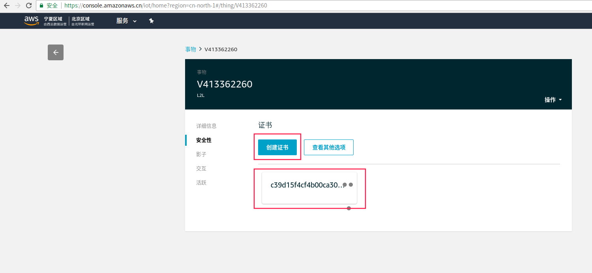
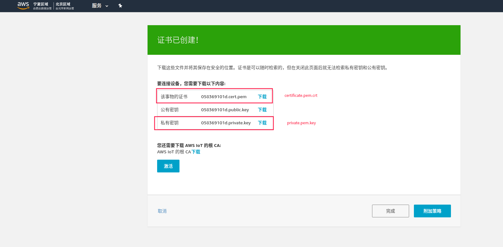
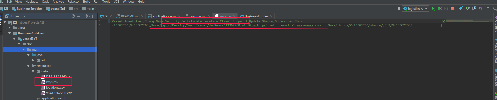
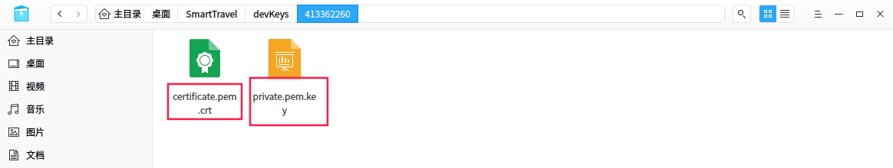
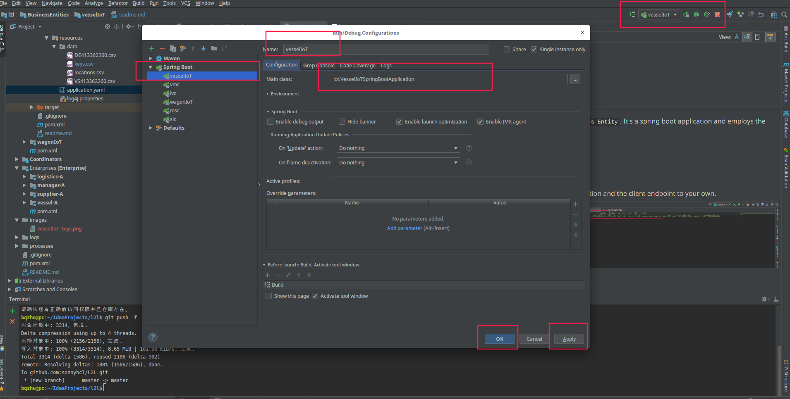

# Wagon Business Entity
## Introduction
This system is introduced into L2L as `Vessel Business Entity`. It's a spring boot application and employs the AWS IoT technology to simulate the vessel.
### Prerequisites 
- Development Tools
   - IDE: [Intellij IDEA](https://www.jetbrains.com/idea/download)
   - AWS IoT : [AWS Cloud](https://console.amazonaws.cn/iot/home?region=cn-north-1#/dashboard)
### Run Configuration.
- AWS IoT-Core certificate configuration.
 - Create certificate for IoT in AWS IoT.
   
  

 - Modify the AWS IoT-Core security certificate location and the client endpoint to your own.
  
 - Note that the certificate files must be named `certificate.pem.crt` and `private.pem.key`separately
    
- Add run configuration for spring boot Application 
  

