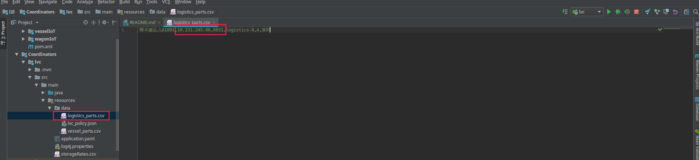
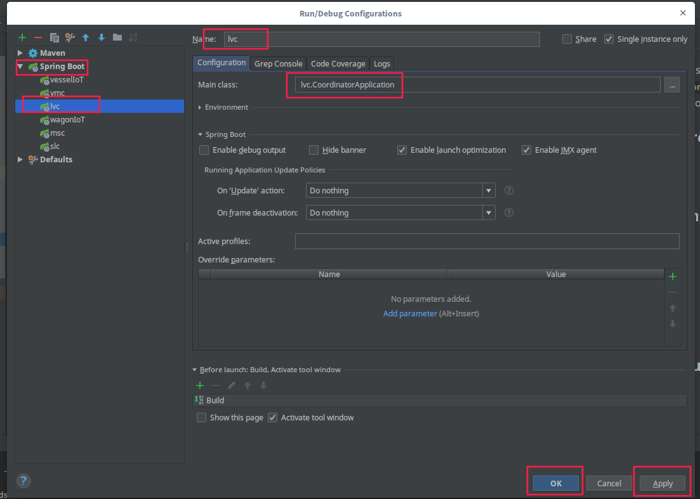

# Logistics Vessel Coordinator
### Introduction
This System is introduced into L2L as `Cross-Enterprise Coordinators`. `Decision Making`and`Relay Station` are involved in the system.
### Prerequisites
 - Development Tools
   - IDE: [Intellij IDEA](https://www.jetbrains.com/idea/download)
### Enterprises configuration 
 - Manager enterprise
    - Modify the host and port of the logistics enterprise in `logistics_parts.csv`.
  
 - Supplier enterprise
    - Similarly modify the host and port of the vessel enterprise in `vessel_parts.csv`.
### Run Configuration.
- Add run configuration for spring boot Application 
  

