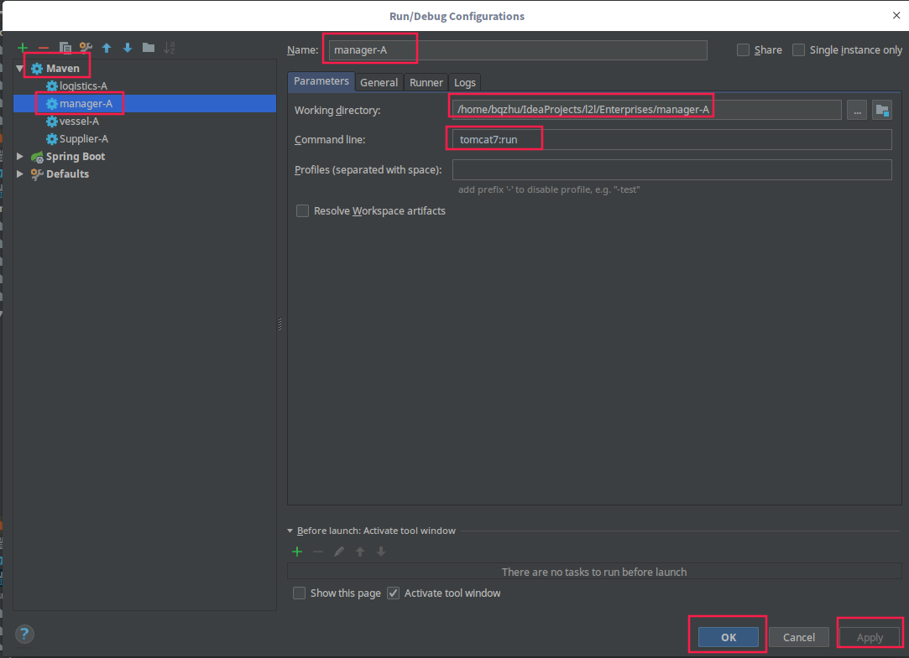
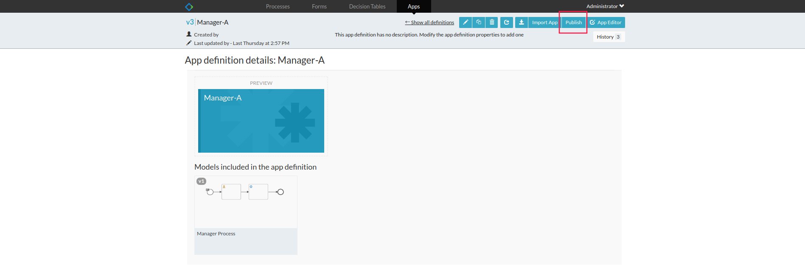

# Manager Enterprise
Manager Enterprise 

## Prerequisites 
- Development Tools
   - IDE: [Intellij IDEA](https://www.jetbrains.com/idea/download)    
   - Database: [MYSQL](https://www.mysql.com/)
## DataBase Configuration
- Make sure you have installed `MySql` and your mysql has a empty schema called `managerA`.
- You can customize your own database configuration in [activiti-app.properties](src/main/resources/META-INF/activiti-app/activiti-app.properties)
    - `datasource.url` : jdbc:mysql://127.0.0.1:3306/managerA?characterEncoding=UTF-8
    - `datasource.username` : root
    - `datasource.password` : root
## AWS Client Configuration 
- You need to alternate  the AWSIoT Client configuration in [activiti-app.properties](src/main/resources/META-INF/activiti-app/activiti-app.properties)
    - `awsiot.clientEndpoint` : AWSIOT client endpoint.
    - `awsiot.clientId` : AWSIoT client identifier, unique string.
    - `awsiot.certificateFile` : the file location of the AWSIoT certification 
    - `awsiot.privateKeyFile` : the file location of  the AWSIoT private key.
## Coordinator and Business Entities Endpoint Configuration
- config the endpoint and other properties relevant to `Cross-Enterprise Coordinators` in [activiti-app.properties](src/main/resources/META-INF/activiti-app/activiti-app.properties)
    - `org.mscContextPath` : endpoint for `Manager Supplier Coordinator`.
    - `org.slcContextPath` : endpoint for `Supplier Logistics Coordinator`.
## Run Configuration
- Add run configuration for this Maven project.
    
- Login url :  [http://localhost:9011/manager-A/](http://localhost:9011/manager-A/), you can login in the system as the default user.
     - `username`: admin
     - `password`: test
## Import suplier process models into the system.
- You need to upload 'Manager-A.zip' under the root directory `processes` and  publish your app, then  go to processes page to start the selected process.
    
     

