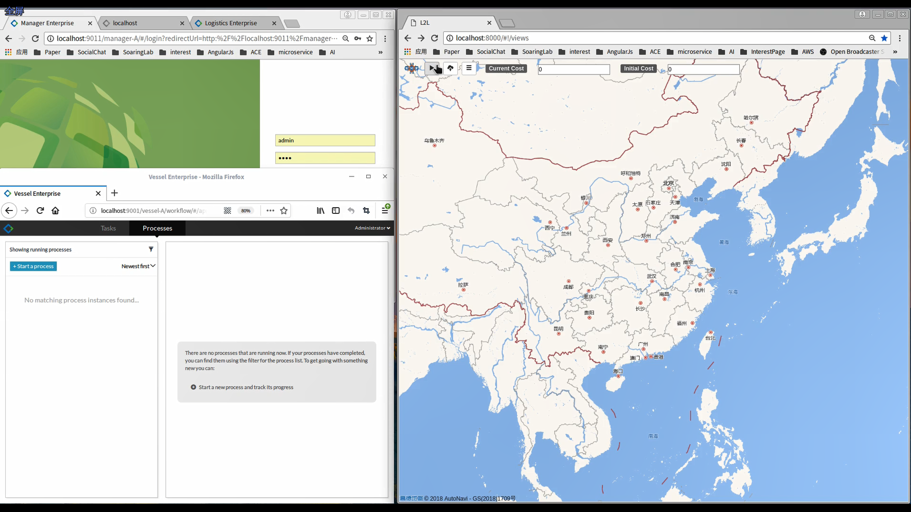

# L2L Framework

This space includes part of the source of the L2L framework and provides support material for the demo paper:

***Coordinating IoT-enabled Autonomous Processes in Cross Enterprise Service Systems 
Authored by Biqi Zhu, Chenglong Hu, Lin Ye, Hong-Linh Truong and  Liang Zhang***

submitted to [ICSOC 2018](http://icsoc.org/).

## Project Structure
```console
L2L
├── BusinessEntities
│   ├── vesselIoT
│   └── wagonIoT
├── Coordinators
│   ├── lvc
│   ├── msc
│   ├── slc
│   └── vmc
├── Enterprises
│   ├── logistics-A
│   ├── manager-A
│   ├── supplier-A
│   └── vessel-A
├── pom.xml
└── README.md
```

## User Guide
- README List :
    - [Logistics Vessel Coordinator README](Coordinators/vmc/README.md)
    - [Manager Supplier Coordinator README](Coordinators/msc/README.md)
    - [Supplier Logistics Coordinator README](Coordinators/slc/README.md)
    - [Logistics Vessel Coordinator README](Coordinators/lvc/README.md)
    - [Vessel Enterprise README](Enterprises/vessel-A/README.md)
    - [Manager Enterprise README](Enterprises/manager-A/README.md)
    - [Supplier Enterprise README](Enterprises/supplier-A/README.md)
    - [Logistics Enterprise README](Enterprises/logistics-A/README.md)
    - [Vessel Business Entity README](BusinessEntities/vesselIoT/README.md)
    - [Wagon Business Entity README](BusinessEntities/wagonIoT/README.md)

## Video
[](https://www.dropbox.com/s/x4i6j2s3hyrs3om/ICSOC2018-v2.mp4?dl=0)

## Dependencies
-   [`L2L Frontend`](https://github.com/i-qiqi/L2L/tree/lambda)
    > Attention: In order to perform as [demo](#demo) shows, The project must be coordinated with the `L2L Frontend` project.
